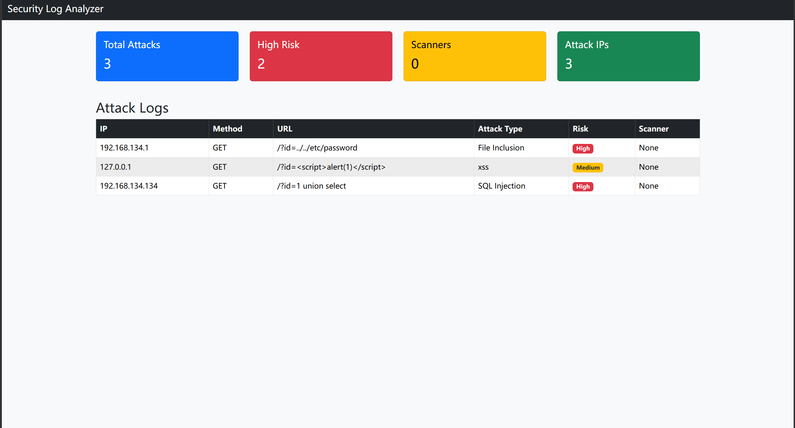

# Log Analyzer

基于 Python + Flask 的安全日志分析平台。

项目能够实时读取 Linux nginx access.log，
识别 SQL注入、XSS、文件包含等 Web攻击行为，
并通过 Dashboard 展示安全事件。

支持：

- 实时日志分析
- 风险等级识别
- User-Agent 扫描器检测
- Dashboard 可视化

## 新功能

- Linux nginx 日志读取
- 实时日志分析
- URL Decode 处理
- 自动刷新 Dashboard
- 真实攻击检测
## 项目截图

